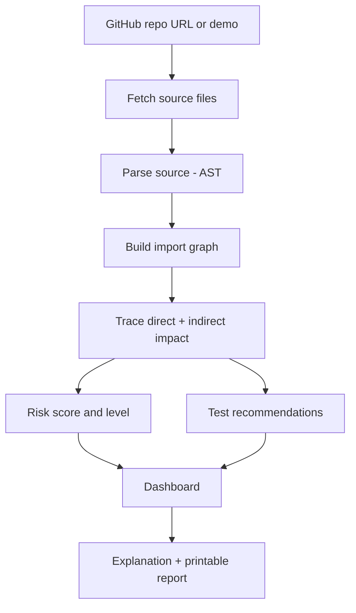

# CodeBlast Radar

> **See what your code change can break — before it breaks production.**

CodeBlast Radar is a dependency-based change-impact tool. Pick a changed file in a repository and it shows which other files are **potentially affected**, how far the effect reaches, an **estimated risk level**, and which tests are worth running.

> **Honesty note:** results are a dependency-based estimate and a risk indicator. They do not predict or guarantee bugs.

---

## Problem

Developers know what they changed, but not everything that depends on it. A Git diff shows changed lines, code search shows one symbol at a time, and side effects often surface late — in review, QA or production.

## Solution

CodeBlast Radar combines the change, the dependency graph, distance from the change and a transparent risk score into one view.



## Features

- **Repository input** — public GitHub URL (validated) or the built-in **Try demo** button (no token, no internet needed).
- **Real static analysis** — the TypeScript compiler API parses JS/TS/TSX; a lightweight parser handles Python.
- **Dependency graph** — interactive React Flow graph; click a node to see why it is affected.
- **Direct vs indirect impact** — distance 1 is direct, distance 2+ is indirect.
- **Transparent risk score** — 0–100, LOW / MEDIUM / HIGH / CRITICAL, every reason shown with its points.
- **Test recommendations** — rule-based suggestions for payment, auth, database and order code.
- **Explanation** — plain-language summary generated deterministically (works with no AI key).
- **Report** — print-friendly view; use the browser's "Save as PDF".
- **Live repo analysis** — fetches the latest commit's files and lets you choose which file counts as "changed".

## Risk scoring

The score is deterministic and configurable (`defaultConfig` in `lib/analyze.ts`).

| Rule | Points |
|---|---|
| Payment / auth / security file changed | +30 |
| Database layer affected | +15 |
| Controller / API affected | +10 |
| Each direct neighbour (distance 1) | +4 |
| Each indirect file (distance 2+) | +3 |
| No test file imports the changed file | +10 |

The total is capped at 100. Levels: **0–25 LOW**, **26–50 MEDIUM**, **51–75 HIGH**, **76–100 CRITICAL**.

**Demo example:** `PaymentService.ts` → 30 + 15 + 10 + 12 (3 direct) + 6 (2 indirect) = **73 / 100 → HIGH**.

## Tech stack

| Area | Technology |
|---|---|
| Frontend | Next.js 14, React 18, React Flow |
| Backend | Next.js API routes (Node.js) |
| Parsing | TypeScript compiler API (JS/TS), simple parser (Python) |
| Data source | GitHub REST API |
| Tests | Vitest |
| Database | None — analysis runs per request |

## Project structure

```
codeblast-radar/
├── app/
│   ├── api/analyze/route.ts   # POST /api/analyze (demo or live repo)
│   ├── page.tsx               # Dashboard UI
│   ├── layout.tsx
│   └── globals.css
├── lib/
│   ├── analyze.ts             # Parser, graph, traversal, scoring, tests, explanation
│   └── github.ts              # GitHub fetching and error handling
├── demo/repository/           # ShopFlow sample app used by "Try demo"
├── tests/analyze.test.ts      # Unit tests
├── .env.example
└── package.json
```

## Installation and running

Requirements: **Node.js 18+**.

```bash
npm install
npm run dev        # http://localhost:3000
```

Production build:

```bash
npm run build
npm start
```

Open http://localhost:3000 and click **Try demo**.

> **Windows PowerShell:** if `npm` is blocked ("running scripts is disabled"), run `Set-ExecutionPolicy -Scope CurrentUser RemoteSigned` once, or use `npm.cmd` instead of `npm`.

## Environment variables

Copy `.env.example` to `.env.local` (optional — the demo works without any keys).

| Variable | Purpose |
|---|---|
| `GITHUB_TOKEN` | Raises GitHub API rate limits and allows private repos you can access. Stays on the server. |
| `OPENAI_API_KEY` | Reserved for future AI-written explanations. Not used yet. |

## Using a live repository

1. Paste a public URL such as `https://github.com/owner/repo` and click **Analyze repository**.
2. The latest commit's changed source file is selected automatically.
3. Use the **Analyze change in** dropdown to pick another file.

Limits: up to 150 source files, each under 100 KB. `node_modules`, `dist`, `build`, `coverage`, `vendor` and similar folders are skipped. Only `.js .jsx .ts .tsx .py` files are read.

## Testing

```bash
npm test
```

Covers URL validation, parsing, A → B → C distances, risk classification, Python import linking and the full demo analysis (5 affected files: 3 direct, 2 indirect, HIGH).

## Security

- Repository code is **only read as text** — never executed, never installed.
- Repository URLs are validated against `https://github.com/owner/repo`.
- `GITHUB_TOKEN` is read on the server only and is never sent to the browser.

## Limitations

- File-level, import-based graph — no function-call edges yet.
- Dynamic imports and runtime behaviour are not detected.
- Supports JavaScript, TypeScript and Python only.
- Python import resolution is simple and may miss unusual project layouts.
- Not yet verified against many real-world repositories.
- No test-coverage data; "missing tests" means no test file imports the changed file.
- Explanation is rule-based; no LLM is used yet.
- Large repositories are truncated to the first 150 source files.

## Future improvements

- GitHub Pull Request comments and GitHub Actions integration
- Function-level graph and call edges
- More languages (Java and others)
- LLM-written explanations built on the static-analysis data
- Test-coverage integration and historical risk tracking
- Slack alerts

## Team

| Name | Role |
|---|---|
| _Your name_ | Frontend / UI |
| _Your name_ | Backend / static analysis |
| _Your name_ | Demo, testing, documentation |

## License

Add a license of your choice (for example MIT) before publishing.
